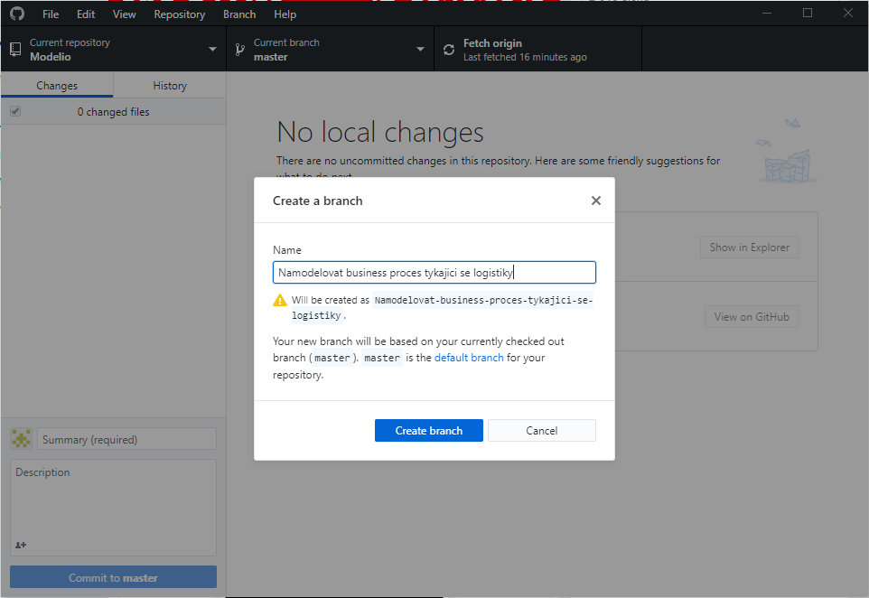
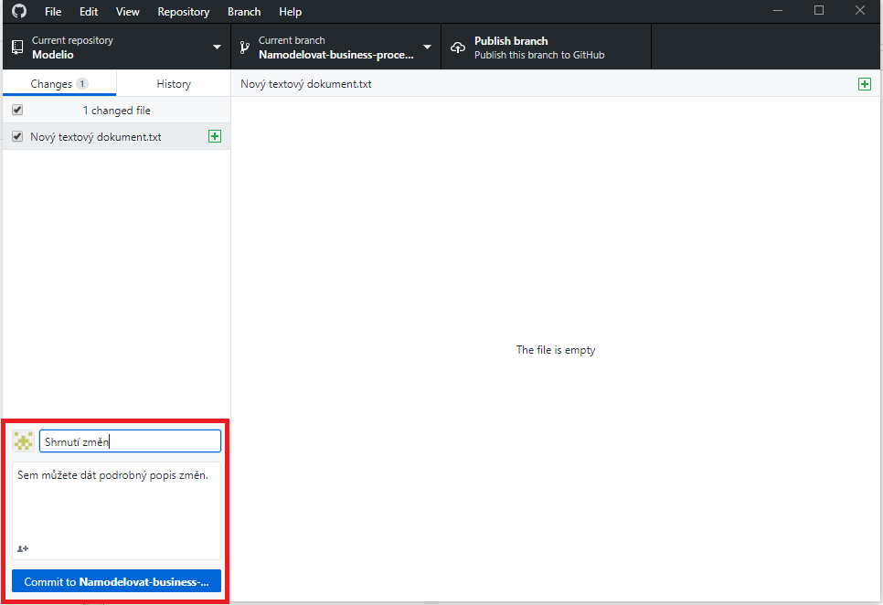

# Pet food manufacturing company

## Programy ke stažení
Proto abyste mohli začít pracovat budou potřeba 4 programy:
1. Modelio https://www.modelio.org/downloads/download-modelio.html
2. ArchiMate modul pro Modelio https://www.modeliosoft.com/en/downloads/plugins/archimate.html
3. Git https://git-scm.com/downloads
4. Github desktop klient https://desktop.github.com/

## Workflow

1. Člověk kterému je přidělen úkol si přes Github klienta vytvoří z master branche novou branch

 

 
2. Potom už jenom uděláte zadaný úkol a po jeho dokončení commitnete a pushnete změny na server. Je dobré commitovat vždycky při nějaké důležité změně a dávát hodně výstižné zprávy ke commitu, jelikož to nikdo z rozdílu mezi verzemi ze změn souborů nevyčte.

 

 
3. Až je všechno hotové, tak prosím vytvořte pull request a dejte mě jako reviewera. Dostanu tak notifikaci že je to udělané a můžu to začít lepit dohromady v master branchy.

 

 

#### Upozornění!
Na 1 větvi by měl vždycky pracovat jenom jeden člověk najednou. Pokud na ní pracují dva lidé a více je potřeba aby jste se domluvili kdo bude pracovat v jakém pořadí.  Další lidé si potom jenom pullnou změny ze serveru

                              
